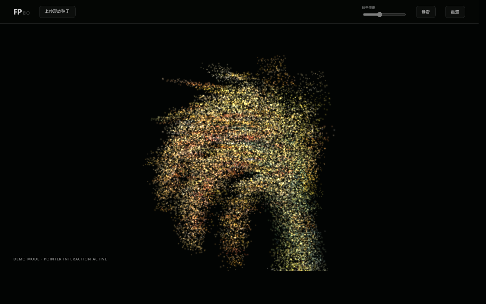
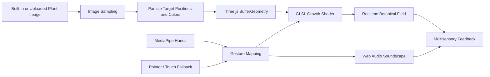

# FloraPulse

**FloraPulse** is an image-conditioned multisensory botanical particle system for art-therapy interaction research. It transforms a built-in or user-uploaded plant image into a real-time WebGL particle growth field, then couples visual morphing, hand gestures, pointer interaction, and a generative soundscape into one browser-based experience.

Repository: https://github.com/believeinmyself889-lang/florapulse

The default case uses `rice.png`, a rice image prepared for a cultural botanical interaction scenario. The system is not limited to rice: any uploaded botanical image can become the target form for the growth animation.



## Features

- Image-conditioned particle growth from the built-in `rice.png` case or a user-uploaded image.
- Real-time WebGL particle rendering with shader-based growth, sway, glow, depth variation, and disturbance effects.
- MediaPipe Hands interaction for growth control and two-hand disturbance.
- Low-pass gesture smoothing for steadier pinch growth and disturbance control.
- Pointer and touch fallback for demos, accessibility testing, and no-camera environments.
- Web Audio API soundscape with growth tones, scattering tones, delay, and filtered wind noise.
- Minimal interface designed for focused interaction instead of dashboard-style operation.
- `?demo=1` mode for screenshots, documentation, and conference demos without camera prompts.

## Technical Stack

- HTML5, CSS3, JavaScript
- Three.js r128
- GLSL shaders
- MediaPipe Hands
- Web Audio API
- Static deployment through any HTTP server or Docker/Nginx

## Architecture



## Quick Start

Run the project as a static web page from the repository root:

```bash
python -m http.server 8787 --bind 127.0.0.1
```

Open:

```text
http://127.0.0.1:8787/index.html
```

For a no-camera preview:

```text
http://127.0.0.1:8787/index.html?demo=1
```

Camera-based hand tracking requires a browser context that allows camera access, such as `localhost` or HTTPS.

## Docker Deployment

```bash
docker build -t florapulse .
docker run --rm -p 8787:80 florapulse
```

Then open:

```text
http://127.0.0.1:8787/index.html?demo=1
```

## Interaction API

FloraPulse is a browser-native research prototype rather than a REST service.

| Interface | Description |
|---|---|
| `rice.png` | Built-in default botanical image loaded on startup |
| Image upload | Replaces the default rice target with a user-selected image |
| `?demo=1` | Enables pointer-first demo mode without requesting camera access |
| Single hand | Controls growth intensity through thumb-index distance |
| Two hands | Left hand controls growth; right index-finger position controls disturbance |
| Pointer / touch | Provides fallback disturbance and growth activation |
| Size slider | Adjusts particle size |
| Mute button | Toggles generated soundscape output |
| Reset button | Restores a neutral spherical particle field |

## Screenshots

Current verified local render:


## Demo

The repository is intentionally static. A demo can be served by Python, Docker, Nginx, GitHub Pages, or any static file host.

Recommended demo URL after deployment:

```text
/index.html?demo=1
```

## Benchmark

No user-study results or therapeutic outcome claims are included in this repository. The benchmark runner measures local engineering behavior only.

Run:

```bash
node scripts/run-benchmark.mjs
```

The latest local result is written to `benchmarks/results/latest.json`, which is ignored by Git because values are machine-specific. See `docs/BENCHMARK.md` for the measurement protocol.

Optional artifact screenshots can be regenerated with:

```bash
node scripts/capture-botanical-results.mjs --out docs --case=rice
```

## Privacy and Research Boundary

This public repository contains only the source code, default public asset, screenshots, deployment files, benchmark script, and evidence-safe evaluation protocol. The manuscript source, manuscript PDF, unpublished submission notes, local benchmark JSON, and private project documents are intentionally excluded.

FloraPulse should be described as an art-therapy interaction research prototype, not as a medical device or treatment. Camera frames are used for browser-side hand tracking during interaction; this repository does not include a backend service for uploading or storing camera data.

See `docs/OPEN_SOURCE_PRIVACY_REVIEW.md` for the release-scope audit.

## Citation

```bibtex
@software{florapulse_2026,
  title  = {FloraPulse: An Image-Conditioned Multisensory Botanical Particle System for Art-Therapy Interaction},
  author = {Zhenghao},
  year   = {2026},
  url    = {https://github.com/believeinmyself889-lang/florapulse},
  note   = {Research prototype}
}
```

## License

This project is released under the MIT License. See `LICENSE` for details.
